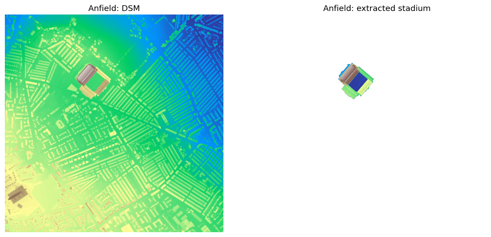
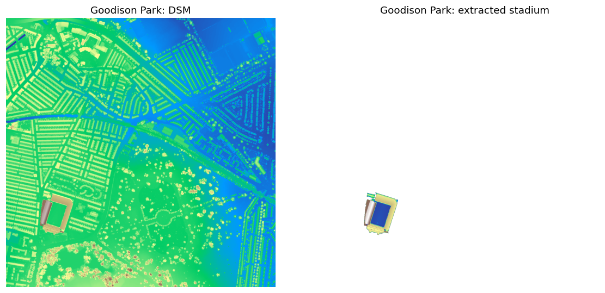

# Stadium Extraction from LiDAR Elevation Data

Extracting football stadiums from a high-resolution LiDAR digital surface model (DSM) of
Liverpool with morphological attribute filtering on a max-tree, without any training data.

**Joshua Owen Mangotang**, ERSIP final assignment, University of South Brittany, 2025.

<p align="center">
  
</p>

## Method

The DSM is represented as a max-tree ([SAP](https://pypi.org/project/sap/)), where every node is
a connected component of the elevation surface. Each node is described by five attributes, and
only nodes inside the chosen ranges are kept:

| Attribute | Why it helps |
| --- | --- |
| Area | stadiums have much larger footprints than houses |
| Height | stands and roofs rise well above the ground |
| Compactness | removes elongated shapes such as roads |
| Circularity | a custom attribute, 4π · area / contour length², that favours round and oval shapes |
| Dynamics | stadiums contrast strongly with their surroundings |

The kept nodes are reconstructed into an image, and the enclosed pitch is added back by filling
the holes inside the extracted structure.

## Results

| Parameter | Anfield | Goodison Park |
| --- | ---: | ---: |
| Area (px) | 5,000 to 100,000 | 5,000 to 100,000 |
| Height (m) | 40 to 74 | 25 to 49 |
| Compactness | 0.01 to 0.11 | 0.01 to 0.21 |
| Circularity | 0.06 to 0.9 | 0.06 to 0.9 |
| Dynamics percentile | 100 | 90 |

<p align="center">
  
</p>

Area, height and compactness do most of the work. Circularity makes small visual changes but
separates the oval stadiums from rectangular buildings and car parks. Dynamics has no effect at
Anfield, whose stands already contrast strongly with their surroundings, while at Goodison Park a
100% threshold keeps only a single node, so 90% is used.

## Usage

```bash
pip install -r requirements.txt
jupyter lab stadium_extraction.ipynb
```

The filters in the notebook are interactive sliders (ipywidgets), so run it to explore the
parameters; the figures above use the default slider values.

## Data

The DSM tiles in `data/` come from the [UK Environment Agency survey data](https://environment.data.gov.uk/survey)
and contain public sector information licensed under the
[Open Government Licence v3.0](https://www.nationalarchives.gov.uk/doc/open-government-licence/version/3/).

## License

Code under the [MIT License](LICENSE).
